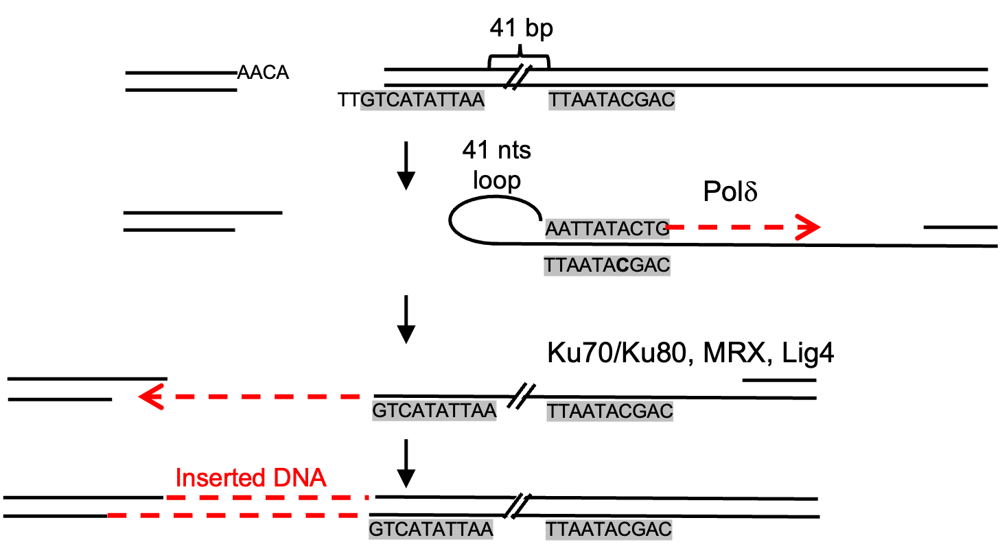

# Local Temple Inversion Analyses
When we investigated templated insertions in yeast at DSBs using amplicon sequencing across repaired locus, we document very short (most ~2-34 bp), local templated inverted insertions at DSBs. These local inversions are generated through a foldback mechanism that utilizes microhomologies adjacent to the DSB. Here we developed iMMBIR to detect these local short foldback inversions. 

 
 
## Method
To identify insertions facilitated by local templated foldback inversions, the algorithm initially delineated the template inverted sequence based on microhomology between a terminal region at the break site and a neighboring region. The seed sequence, consisting of the template sequence (TACTT) followed by a short MATa sequence (CAGTATA or CAGCATA) in the MAT-R region, served as the initial scanning of inverted sequence. By constrain this seed sequence (TACTTCAGTATA or TACTTCAGCATA), we will ensure that the scanning process prioritized MATa hotspot insertions more than 5bp. Subsequently, the scanning process extended across both PEAR merged reads and unmerged reversed reads. As occurrences were not detected in unmerged reads, our analysis exclusively focused on merged reads for subsequent analyses. Utilizing BWA mem, we mapped these reads against the ChrIII genome, which had masked the HML and HMR regions. To accurately deduplicate MATa reads, careful scrutiny of CIGAR strings was performed, with special emphasis on avoiding sequencing errors at both sides of MATa regions. Insertions (I) or deletions (D) at either MAT-L or MAT-R regions due to sequencing errors were disregarded. Following this, we executed deduplication, measuring insertion size and read count support for each MATa hotspot insertion. Duplicated reads were identified as those sharing identical sequences containing the inverted sequence and their upstream and downstream 5bp. Furthermore, employing a comparable methodology, we have successfully devised a means to track the local foldback MATa insertion with the novel long MATa primer Break-ins. Additionally, our protocol allowed us to identify alternative template MATa sequences, including "GAAGTTTTATA" and "GCAACATACATT."

Given the challenge of determining the 2-4bp template sequences, we specifically defined reads with MATa hotspot insertions by restricting two seed sequences. For example, in the case of a 3bp MATa hotspot insertion, these seed sequences were generated by matching the template sequences (CTT) but not the 1bp extended template sequences (ACTT), followed by a short MATa sequence (CAGTATA or CAGCATA) in the MAT-R region. The same BWA and CIGAR pipeline methods were applied to analyze these 2-4bp template inversions, respectively.

##  Availability 
1. Scripts for the detection of 1-8 samples that for longer local template inversion (>=5bp)
2. Scripts for the detection of 1-8 samples that for shorter local template inversion (2-4bp)
3. Scripts for the detection that have longer primers
4. Scripts for the other MATa hotpot insertions

## Dependencies

Perl is used to run the scripts. The following softwares are also required:

. bwa

## Citation
_Yu, Y.#*, Wang, X.#, Fox, J., Li, Q., Yu, Y., Hastings, P.J., Chen, K.* and Ira, G*._ **RPA and Rad27 limit templated and inverted insertions at DNA breaks**. _Nucleic Acids Research_(2024).  https://doi.org/10.1093/nar/gkae1159

# Contact

For more detail information, please feel free to contact: xin.wang@childrens.harvard.edu

This project is licensed under the terms of the MIT license.

Copyright (c) 2023 Dr. Kaifu Chen lab

Current version v1.0

